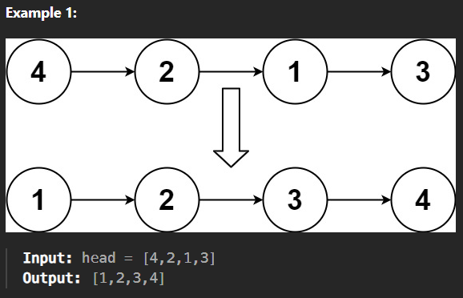
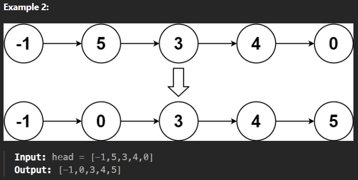

# LeetCode 148 – Sort List

## 📌 Problem Statement
Given the head of a singly linked list, sort the list in **ascending order** and return the sorted list.

---
## Visuals




---

## 💡 Key Insight
Arrays can be sorted efficiently using random access, but linked lists **do not support indexing**.  
Therefore, the optimal sorting algorithm for linked lists is **Merge Sort** because:

- It works well with sequential access
- It does not require extra arrays
- It guarantees `O(n log n)` time complexity

---

## 🧠 Approach: Merge Sort on Linked List

### Step 1: Split the List
- Use **slow and fast pointers**
- Slow moves one step, fast moves two steps
- When fast reaches the end, slow is at the middle
- Break the list into two halves

### Step 2: Recursively Sort
- Recursively apply merge sort on both halves

### Step 3: Merge Two Sorted Lists
- Compare node values
- Recursively merge in sorted order

---

## ✅ C++ Implementation

```cpp
class Solution {
public:
    ListNode* splitList(ListNode* head){
        ListNode* fast = head->next;
        ListNode* slow = head;

        while (fast != nullptr && fast->next != nullptr){
            fast = fast->next->next;
            slow = slow->next;
        }

        ListNode* second = slow->next;
        slow->next = nullptr;
        return second;
    }

    ListNode* merge(ListNode* first, ListNode* second){
        if (first == nullptr) return second;
        if (second == nullptr) return first;

        if (first->val <= second->val){
            first->next = merge(first->next, second);
            return first;
        } else {
            second->next = merge(first, second->next);
            return second;
        }
    }

    ListNode* mergeSort(ListNode* head){
        if (head == nullptr || head->next == nullptr)
            return head;

        ListNode* second = splitList(head);

        head = mergeSort(head);
        second = mergeSort(second);

        return merge(head, second);
    }

    ListNode* sortList(ListNode* head) {
        return mergeSort(head);
    }
};
```

---

## ⏱️ Complexity Analysis

| Metric | Complexity |
|------|-----------|
| Time | `O(n log n)` |
| Space | `O(log n)` (recursion stack) |

---

## 🧪 Example

**Input**
```
4 -> 2 -> 1 -> 3
```

**Output**
```
1 -> 2 -> 3 -> 4
```

---

## 🏆 Why Merge Sort?
- Quick Sort is inefficient on linked lists
- Heap Sort requires extra memory
- Merge Sort preserves node structure and stability

---

## 📌 Conclusion
Merge Sort is the **best and optimal solution** for sorting a linked list.  
It achieves the required time complexity while keeping memory usage minimal.

---

✨ *Interview Tip*:  
If asked “Why not quick sort?”, answer:
> Because linked lists don’t support random access efficiently.