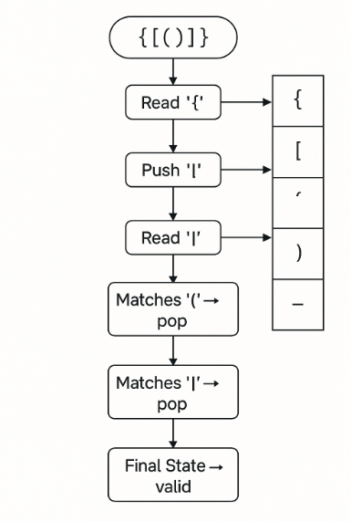

# LeetCode 20 – Valid Parentheses

## 📝 Problem Summary
Given a string `s` containing just the characters `(`, `)`, `{`, `}`, `[` and `]`, determine whether the input string is valid.

A string is considered **valid** if:
1. Open brackets are closed by the same type of brackets.  
2. Open brackets are closed in the correct order.  
3. Every closing bracket must correspond to a previously opened bracket.

---

## 🔍 Examples

### Example 1
**Input:** `s = "()"`  
**Output:** `true`

### Example 2
**Input:** `s = "()[]{}"`  
**Output:** `true`

### Example 3
**Input:** `s = "(]"`  
**Output:** `false`

---

## 💡 Approach

We use a **stack** to track opening brackets.  
Whenever we see a closing bracket, we check if the top of the stack has the corresponding opening bracket.

## Visuals:


### Steps:
1. Create a map of opening → closing brackets.  
2. Traverse the string:
   - If it's an opening bracket, push to stack.
   - If it's a closing bracket:
     - If stack is empty → invalid.
     - Check if it matches the top of stack.
3. In the end, stack must be empty.

---

## ⏱️ Time & Space Complexity

### **Time Complexity:**  
- O(n) — each character is processed once.

### **Space Complexity:**  
- O(n) — in worst case, all opening brackets are pushed to the stack.

---

## ✅ Code (C++)

```cpp
class Solution {
public:
    bool isValid(string s) {
        unordered_map<char,char> mp = {
            {'(', ')'},
            {'[', ']'},
            {'{', '}'}
        };

        stack<char> st;

        for (char c : s) {
            if (mp.count(c)) {
                st.push(c);
            } else {
                if (st.empty()) return false;
                if (mp[st.top()] == c) st.pop();
                else return false;
            }
        }
        return st.empty();
    }
};
```

---

## 📌 Notes
- This is a classic stack problem frequently asked in interviews.
- Works for all combinations and nesting patterns.

---

## 📂 File Info
This README explains the logic, steps, complexities, and code for **LeetCode Problem 20 — Valid Parentheses**.

---